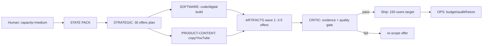

# ARTIFACT: Workflow A Step 1 — STRATEGIC — 9-day content-engine run

> Produced 2026-08-30 by STRATEGIC for the real initiative with the user-set 9-day targets.
> Goal restated in one sentence, then principles, 9-day done, trade-offs, system map, cheapest test, irreversible mistakes, files to write.

## 1. Real goal (one sentence)
Ship **30 high-quality offers** (digital products, code, YouTube content, licensed) that reach **150 active users** and prove real problems with data evidence, within **9 days** and **≤ $50 AI spend**, at an extreme non-verbal/emotional professionalism bar.

## 2. Durable principles vs temporary tactics
**Durable (in PRINCIPLES.md):** the 7 governing principles (files=truth; one operator; 7-year survival; human approval; evidence-first; one initiative; survival>peak).

**Temporary tactics (NOT principles):** the 30-offer batch composition, specific offer types, channel mix, which models route where.

## 3. Trade-off map
| Trade-off | Lean | Cost |
|---|---|---|
| Quality bar | extreme, emotional | fewer offers shipped safely |
| Evidence | data-proven claims | slower per offer |
| Volume | 30 offers / 9d | high scope (P5) / quality (P1) risk |
| Budget | ≤ $50 | limits iterations |
| Sovereignty | own files | more manual work |
| Speed | 9-day cycle | less polish per item |

## 4. Mermaid system map

## 5. 9-day done (testable — user-set)
By 2026-09-06: **30 offers live; 150 active users; ≤ $50 AI spend;** every offer carries a verified evidence block; all artifacts filed in the store.

## 6. Cheapest test (days 1–3)
Validate the **top 3–5 offer candidates** with ~10 real target users each. Weak signal → cut. Then ship wave 1; scale to 30 only on evidence, not on volume pressure.

## 7. Biggest irreversible mistake
Committing all product/content data to one non-exportable platform before wave 1 validates. Cheapest reversal: keep files first (C5), export often.

## 8. Exact files to write into the store (same day)
- `STATE-PACK.md` — 9-day done + capacity (done)
- `DECISIONS.md` — D-20260830-06 (done)
- `INITIATIVES/20260830-content-engine.md` — 9-day done (done)
- `PRINCIPLES.md` — confirm the 7 still hold (review, no change needed unless user amends)
- `ARTIFACTS/` — this STRATEGIC run + each wave's shipped offers with evidence blocks
- `AUDITS/` — weekly audit at cycle midpoint (~day 4–5)

## Next operator
SOFTWARE and/or PRODUCT-CONTENT with the accepted strategy; then CRITIC; then OPS.

---
**META**
- OS: v30 | Operator: STRATEGIC | Artifact type: Workflow A Step 1 (9-day run)
- Date: 2026-08-30 | Confidence: medium (target is aggressive; batch plan mitigates)
- Expiry: 2026-09-06
- Assumptions: "active users" and "offers live" scope confirmed by user; evidence bar applies to all
- Principles used: C1, C4, C5, C6
- Sovereignty risks: none — proposes only; user accepts/rejects
- Failure modes: quality collapse if all 30 rushed (batch guardrail); overload (capacity=medium)
- What would make this false: user's real targets differ
- Next human action: confirm first-wave offers (3–5) + what failed recently
- Next operator: SOFTWARE / PRODUCT-CONTENT

**HANDOFF**
- From: STRATEGIC | To: SOFTWARE / PRODUCT-CONTENT
- Original goal: run Workflow A Step 1 with real targets
- Delivered: goal, 9-day done, trade-offs, map, cheapest test, irreversible mistakes, files
- Not delivered: first-wave offer selection (needs user input)
- Assumptions: batch-and-validate approach accepted
- Open questions: which 3–5 offers ship days 1–3? what failed recently?
- Recommended next prompt: SOFTWARE/PRODUCT-CONTENT with wave-1 scope
- Do-not-violate: evidence-first; human approval to publish; ≤ $50; no invented metrics
- Freeze recommended? no
