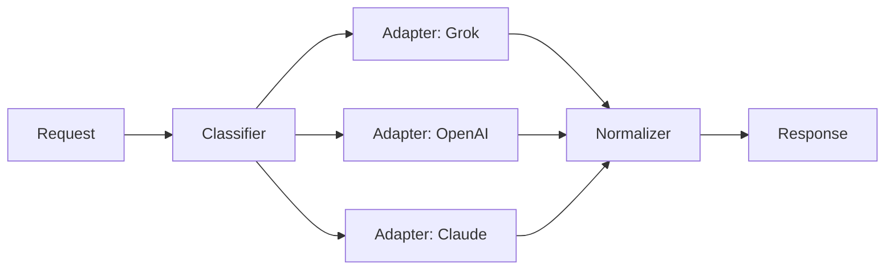

# GOLDEN · Good Architecture + Contracts — v30

> The standard for SOFTWARE output. Demonstrates the required sections.

## Architecture (text)
A stateless HTTP service in Python (FastAPI) that accepts a request, classifies it, routes to a configured model adapter, and returns a normalized response. All config and history live in plain files/JSON; no vendor SDK is imported at the service boundary — each provider is behind one adapter interface.

## Interface contracts
- **POST /route** — `input: {text, intent_hint?}` → `200 {provider, text, cost_usd, latency_ms}` | `503` when all providers down | `400` bad input.
- **Provider adapter** — `route(req) -> {text, cost, latency}`; every adapter implements exactly this. Adding a provider = adding one file.
- **Errors** — typed: `ModelDownError`, `RateLimitError`, `BudgetExceededError`, `InvalidInputError`.

## Data model & invariants
- `Config` (providers, budgets, fallback order) — plain JSON, versioned.
- `RequestLog` — append-only JSON lines; invariant: every request has one row, immutable after write.
- Invariant: total cost for the month never exceeds configured cap (enforced before dispatch).

## Failure modes
- All providers down → 503 + last-good cache.
- Rate limited → exponential backoff, then next provider in cascade.
- Budget exhausted → reject new routed calls, alert human.

## 24/7 notes
- Retries: idempotent request IDs; replay-safe logging.
- Health: `/health` returns adapter states + circuit breaker status.
- Secrets: in env vars / secret store, never in repo.
- Graceful degradation: mock provider returns deterministic output if all real ones fail.

## Replaceability notes
If any single vendor/model/API dies: update `Config`, add/remove one adapter file, run the test suite. No vendor-specific type leaks past the adapter. The whole service can be rebuilt from this repo in under a day.

## Test strategy
- Unit: classifier routing, budget guard, each adapter's normalize.
- Integration: mock provider cascade (deterministic).
- Contract: each adapter passes the same golden request set.

---
**META**
- OS: v30 | Operator: SOFTWARE | Artifact type: architecture + contracts (golden example)
- Date: 2026-08-30 | Confidence: high | Expiry: example
- Assumptions: generic shape; no real API keys
- Principles used: C5, C8, C9
- Sovereignty risks: none — no lock-in
- Failure modes: none in the example
- What would make this false: real requirements differ
- Next human action: supply real requirements
- Next operator: CRITIC
