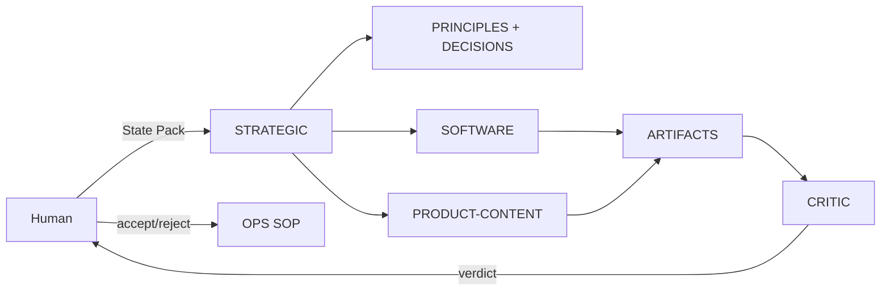

# GOLDEN · Good Strategic One-Pager — v30

> The standard for STRATEGIC output. A real accepted artifact should look like this.
> (This is a **shape example** — it demonstrates the required structure with a generic-but-specific initiative; replace with the user's real one in a dated artifact.)

## Real goal (one sentence)
Ship one customer-validated product in 90 days with a replaceable tech stack and no vendor lock-in, using ≤ $50/month of AI spend.

## Durable principles vs temporary tactics
**Durable (write to PRINCIPLES.md, max 7):**
1. Evidence over assertion — every bet cites where the data came from.
2. One 90-day done at a time; everything else is parked.
3. Stack must run on boring, replaceable tooling (Python/TS + files).
4. Human approval before any external commitment.
5. All knowledge lives in the canonical store the same day.
6. Vendor/model independence — no capability lives in one chat.
7. Survival over peak performance.

**Temporary tactics (not principles):** use Grok this month because of a promo; use a specific MCP server; a particular copy angle for one campaign.

## Trade-off map
| Trade-off | Lean | Cost |
|---|---|---|
| Control | files + own code | more human time |
| Complexity | boring stack | less clever |
| Cost | ≤ $50/mo | fewer model calls |
| Speed | MVP in 90d | less polish |
| Durability | replaceable | slower first build |
| Replaceability | no lock-in | vendor-specific features declined |

## Mermaid system map

## 90-day done (testable)
By day 90: product is live, 5 real users used it, one customer would be upset if it disappeared, all architecture/decisions are in the store, total AI spend ≤ $150, and the whole system can be rebuilt from files in one day.

## Cheapest test
Week 1: 10 interviews/signups for the single value proposition, with no code written. If < 3 people care, freeze and re-scope.

## Biggest irreversible mistake
Buying into a single vendor's non-exportable platform with all product data, before the cheap test.

---
**META**
- OS: v30 | Operator: STRATEGIC | Artifact type: strategic one-pager (golden example)
- Date: 2026-08-30 | Confidence: high (as a standard shape)
- Expiry: example — refresh when first real artifact lands
- Assumptions: this is a shape, not the user's actual initiative
- Principles used: C1–C10
- Sovereignty risks: none — proposes only
- Failure modes: if treated as the real initiative without a State Pack
- What would make this false: user has different durable principles
- Next human action: replace with real initiative via Workflow A
- Next operator: SOFTWARE / PRODUCT-CONTENT
